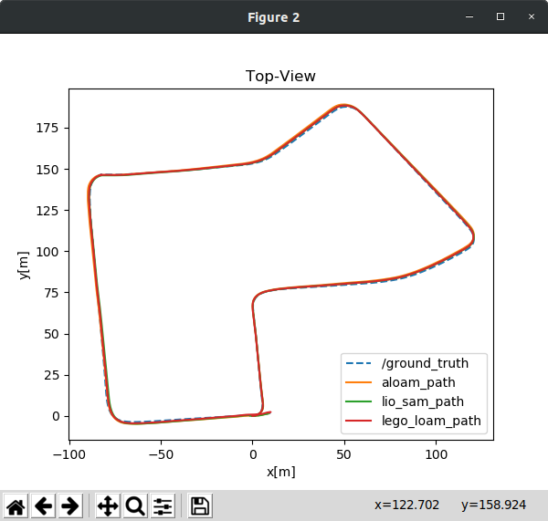
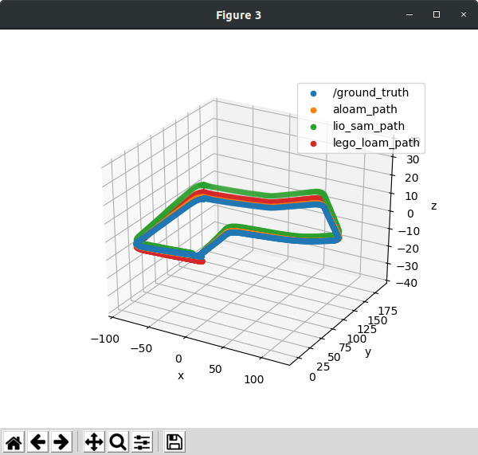
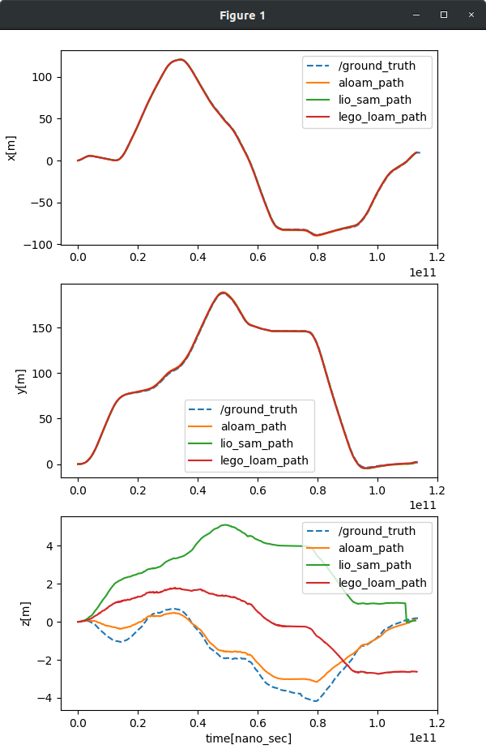
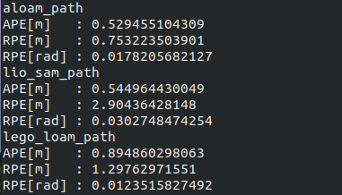
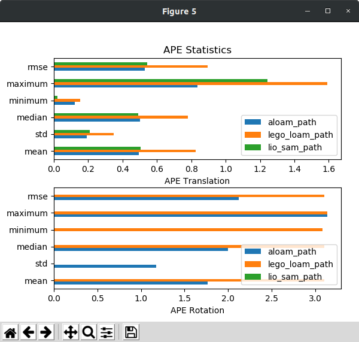
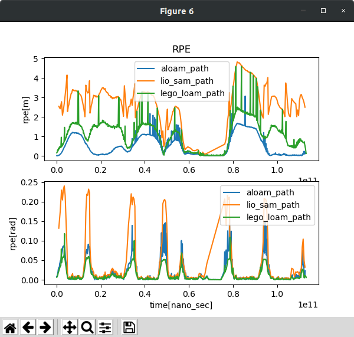
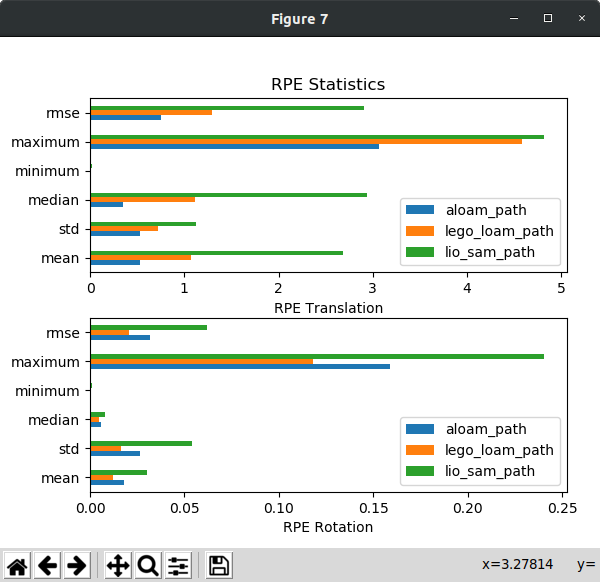

# Framework for evaluation of LiDAR SLAM
This package provides a framework for the comparison and evaluation of trajectory output of the LiDAR SLAM algorithm. We run selected LiDAR SLAM algorithms using the same KITTI Dataset, and plot the resulting trajectory with the ground truth. We provide three different trajectory error graphs.

## Install
To run the script, clone this repository at the ROS workspace directory.

``` sh
    pip install pykitti
    mkdir -p catkin_ws/src && cd catkin_ws/src
    git clone --recurse-submodules http://github.com/haeyeoni/lidar_slam_evaluator.git
    cd ..
    catkin_make
    source devel/setup.sh
```
## Prepare KITTI Dataset

**KITTI Dataset**
- KITTI odometry dataset
- KITTI raw_synced dataset
- KITTI raw_unsynced dataset

## Prepare KITTI dataset
**1. Download Raw Dataset**
```bash
cd your/dataset/path
wget https://s3.eu-central-1.amazonaws.com/avg-kitti/raw_data/2011_09_30_drive_0027/2011_09_30_drive_0027_sync.zip
wget https://s3.eu-central-1.amazonaws.com/avg-kitti/raw_data/2011_09_30_drive_0027/2011_09_30_drive_0027_extract.zip
wget https://s3.eu-central-1.amazonaws.com/avg-kitti/raw_data/2011_09_30_calib.zip
unzip 2011_09_30_drive_0027_sync.zip
unzip 2011_09_30_drive_0027_extract.zip
unzip 2011_09_30_calib.zip
```

Your filesystem tree should be like this:
```bash
├── KITTI odometry dataset
│   └── dataset
│       ├── poses
│       └── sequences
│           ├── 00 
│           ├── 01 
│           ├── ...
│           └── 21
│               ├── image_0
│               ├── image_1
│               ├── velodyne
│               ├── calib.txt
│               └── times.txt
│
└── KITTI raw dataset
    └── dataset
        ├── 2011_09_26
        │   ├── 2011_09_26_drive_00**_sync
        │   │   ├── image_00
        │   │   ├── image_01
        │   │   ├── image_02
        │   │   ├── image_03
        │   │   ├── oxts
        │   │   └── velodyne_points
        │   ├── 2011_09_26_drive_00**_extract
        │   ├── calib_cam_to_cam.txt 
        │   ├── calib_imu_to_velo.txt
        │   └── calib_velo_to_cam.txt  
        │
        ├── 2011_09_30
        └── ...
```

**2. Download Odometry Dataset (with Ground Truth)**

If you want to evaluate your algorithm on KITTI raw dataset with ground truth provided by KITTI odometry poses, you can convert poses.txt file into the rosbag format that produces *nav_msgs::Path* topic. In the case you would like to use IMU data, however, the *rectified_synced* dataset for KITTI raw dataset is required. The table below lists corresponding KITTI sequences to rectified_synced dataset with starting/end index in each sequences.

| seq | name | start | end |
| :------------ | :------------ | :------------ | :------------ |
| 00 | 2011_10_03_drive_0027 | 000000 | 004540 |
| 01 | 2011_10_03_drive_0042 | 000000 | 001100 |
| 02 | 2011_10_03_drive_0034 | 000000 | 004660 |
| 03 | 2011_09_26_drive_0067 | 000000 | 000800 |
| 04 | 2011_09_30_drive_0016 | 000000 | 000270 |
| 05 | 2011_09_30_drive_0018 | 000000 | 002760 |
| 06 | 2011_09_30_drive_0020 | 000000 | 001100 |
| 07 | 2011_09_30_drive_0027 | 000000 | 001100 |
| 08 | 2011_09_30_drive_0028 | 001100 | 005170 |
| 09 | 2011_09_30_drive_0033 | 000000 | 001590 |
| 10 | 2011_09_30_drive_0034 | 000000 | 001200 |


KITTI odometry data that has ground truth can be downloaded in [KITTI odometry data](http://www.cvlibs.net/datasets/kitti/eval_odometry.php) page. (velodyne laser data, calibration files, ground truth poses data are needed.)


**3. Make KITTI dataset bag file**
To generate KITTI raw dataset bag file, execute a bash command below:

```bash
python kitti2bag.py -t date -r drive -p save_to raw_synced your/dataset/path
```
where `save_to` is a directory that you want to save a generated bag file and `your/dataset/path` is a base directory for KITTI raw_synced dataset.  
Replace `date` and `drive` with appropriately syntaxed parameters, such as **2011_09_30** and **0027**, respectively.

Example:
```bash
python kitti2bag.py -t 2011_09_30 -r 0027 -p ../PathRecorder/bag raw_synced /mnt/HDD/kitti_raw
```

**4. Make KITTI ground truth bag file**

To generate KITTI ground truth bag file, which can be converted from `raw_dataset` and `odom_dataset`, run the python script like:

```bash
python gt2bag.py -o odom_path -r raw_path -s sequence -p save_path
```

Replace `odom_path` with your KITTI **odometry** dataset that includes poses.txt for ground truth generation, 
and `raw_path` with your **raw_unsynced** dataset which has a posix-time timepoints.txt file in it. \
Then select what sequence that you looking for, and path to save the ground truth bag file. \
The script will automatically generate the bag file in your pre-made directory.

Example:
```bash
python gt2bag.py -o /mnt/HDD/kitti_lidar/dataset -r /mnt/HDD/kitti_raw -s 07 -p ../PathRecorder/bag
```


Other source files can be found at [KITTI raw data](http://www.cvlibs.net/datasets/kitti/raw_data.php) page.


## Evaluate SLAM algorithms
### Run the script

To run the script, execute the following command. This script runs SLAM algorithm list one by one and record the result. **kitti.bag** and **kitti_gt.bag** file should be exists in BAG FILE DIRECTORY PATH. For LIO-SAM, the package can be downloaded in [LIO-SAM](https://github.com/TixiaoShan/LIO-SAM) original repository. After finishing running all the algorithms, it shows the plot of results. 

``` python
python compare.py --slam [SLAM LIST] --bag_path [BAG FILE DIRECTORY PATH] -- plot [PLOT OPTION] (--no_play)
```

- currently available SLAM LIST: lio_sam, aloam, lego_loam
- Available plotting option
    * `all`   - plot all trajectories and errors and error statistics **default**
    * `traj`  - plot trajectories
    * `error` - plot errors
    * `stat`  - plot error statistics
- If you already have recorded result bag file, add --no_play

Example
```python
python compare.py --slam lego_loam lio_sam aloam --bag_path ../dataset --plot all
```

### Result
plots inspired from https://github.com/MichaelGrupp/evo  
**Trajectory**  


  
**Error** calculated based on paper ['Measuring robustness of Visual SLAM'] (http://arxiv.org/abs/1910.04755 "D. Prokhorov, D. Zhukov, O. Barinova, K. Anton and A. Vorontsova, *Measuring robustness of Visual SLAM,* 2019 16th International Conference on Machine Vision Applications (MVA), 2019, pp. 1-6, doi: 10.23919/MVA.2019.8758020.")  
  




