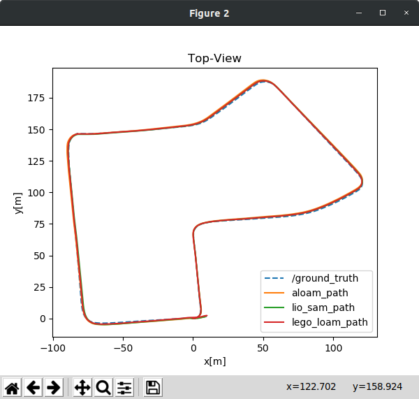
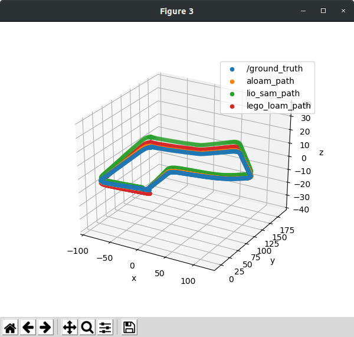
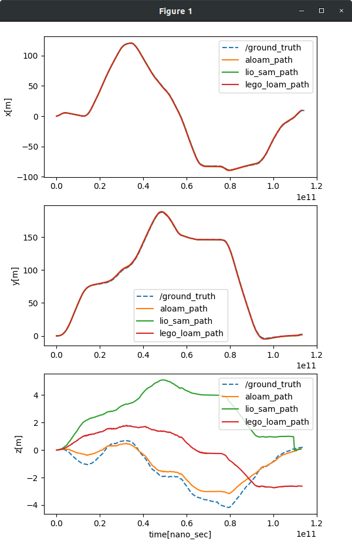
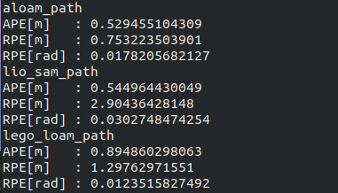
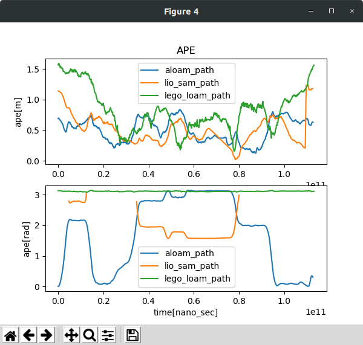
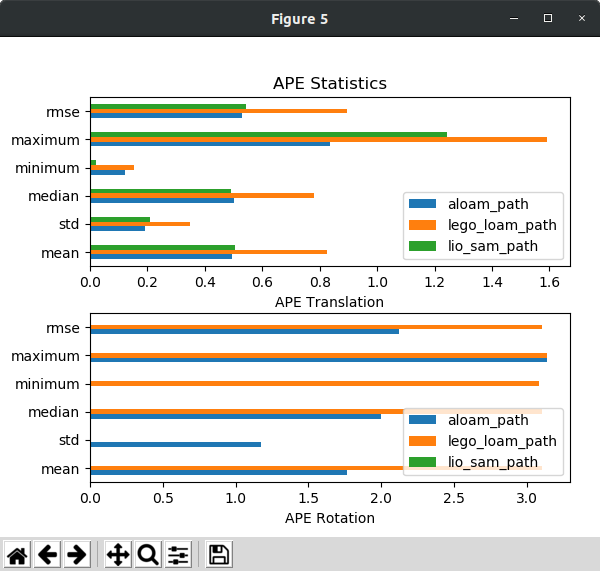
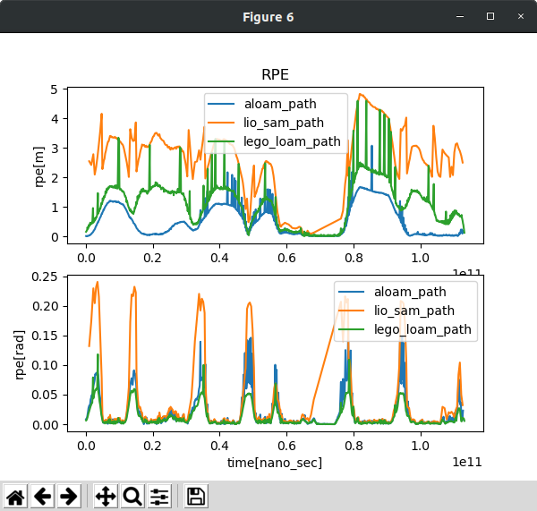
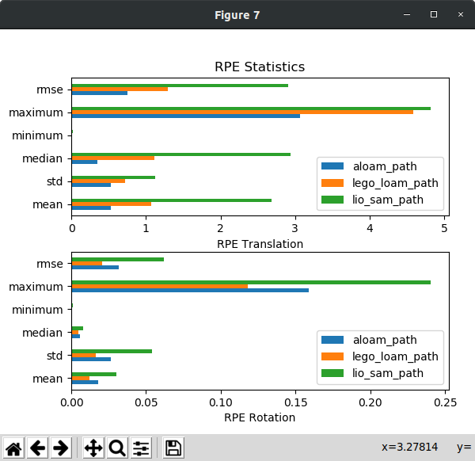

# A framework for Lidar SLAM algorithm evaluation
This package provides a framework for both comparison and evaluation of resultant trajectories that generated from [ROS](https://www.ros.org/) supported Lidar SLAM packages. The framework provides an interface between [KITTI dataset](http://www.cvlibs.net/datasets/kitti/index.php) and Lidar SLAM packages including [A-LOAM](https://github.com/HKUST-Aerial-Robotics/A-LOAM), [LeGO-LOAM](https://github.com/RobustFieldAutonomyLab/LeGO-LOAM) and [LIO-SAM](https://github.com/TixiaoShan/LIO-SAM) for localization accuracy evaluation.   

~~Other Lidar odometry/SLAM packages and even your own Lidar SLAM package can be applied to this evaluation package.(TBD)~~

Using this package, you can record the trajectory from Lidar SLAM packages by given roslaunch files and compare each other qualitatively, or with ground truth provided by KITTI dataset for the quantative evaluation. After the evaluation process, our Python script automatically generates plots and graphs that demostrates error metrics.
   
For detailed intruction, we strongly recommend to read the further step-by-step illustration of the framework.

<p align='center'>
    
</p>

---

## 1. Install this package
Installing this package into your local machine is simple. Clone this repository to your catkin workspace.
   
``` bash
    pip install pykitti (if pykitti is not installed)
    mkdir -p catkin_ws/src && cd catkin_ws/src
    git clone http://github.com/haeyeoni/lidar_slam_evaluator.git
    cd ..
    catkin_make -j1 
    source devel/setup.sh
```
   
`-j1` flag on line 5 is for LeGO-LOAM build. Refer to this [instruction](https://github.com/RobustFieldAutonomyLab/LeGO-LOAM#compile).
   
---
   
## 2. Install Lidar odometry/SLAM packages
The evaluation package currently support three open-source Lidar-based odometry/SLAM algorithms:   
- [A-LOAM](https://github.com/HKUST-Aerial-Robotics/A-LOAM)   
- [LeGO-LOAM](https://github.com/RobustFieldAutonomyLab/LeGO-LOAM)   
- [LIO-SAM](https://github.com/TixiaoShan/LIO-SAM)   
   
Go to the link and follow the instructions written by owner. You may consider changing some parameters for KITTI dataset which used Velodyne HDL-64 Lidar for data acquisition.

**Note**   
- A-LOAM: No need to modify parameter. It is already written for KITTI configurations.   
- LeGO-LOAM: Add Velodyne HDL-64 configuration and disable undistortion functions, or clone this [forked repo](https://github.com/zzodo/LeGO-LOAM).   
- LIO-SAM: Change package parameters for KITTI, or clone this [forked repo](https://github.com/zzodo/LIO-SAM).   
   
---
   
## 3. Prepare KITTI dataset in your machine

**What you need?**
- KITTI odometry dataset
- KITTI raw_synced dataset
- KITTI raw_unsynced dataset

### 3-1. Download KITTI raw_synced/raw_unsynced dataset
```bash
cd your/dataset/path
wget https://s3.eu-central-1.amazonaws.com/avg-kitti/raw_data/2011_09_30_drive_0027/2011_09_30_drive_0027_sync.zip (raw_synced)
wget https://s3.eu-central-1.amazonaws.com/avg-kitti/raw_data/2011_09_30_drive_0027/2011_09_30_drive_0027_extract.zip (raw_unsynced)
wget https://s3.eu-central-1.amazonaws.com/avg-kitti/raw_data/2011_09_30_calib.zip
unzip 2011_09_30_drive_0027_sync.zip
unzip 2011_09_30_drive_0027_extract.zip
unzip 2011_09_30_calib.zip
```
   
Other source files can be found in [KITTI raw data](http://www.cvlibs.net/datasets/kitti/raw_data.php) page.   
   
### 3-2. Download odometry dataset (with ground truth)
   
KITTI odometry data that has ground truth can be downloaded in [KITTI odometry data](http://www.cvlibs.net/datasets/kitti/eval_odometry.php) page. (velodyne laser data, calibration files, ground truth poses data are required.)
   
**Note**   
If you want to evaluate your algorithm on KITTI raw dataset with ground truth provided by KITTI odometry poses, you can convert poses.txt file into the rosbag format that produces `nav_msgs::Path` topic. In the case you would like to use IMU data, however, the `rectified_synced` dataset for KITTI raw dataset is required. The table below lists corresponding KITTI sequences to rectified_synced dataset with starting/end index in each sequences.

| seq | name | start | end |
| :------------ | :------------ | :------------ | :------------ |
| 00 | 2011_10_03_drive_0027 | 000000 | 004540 |
| 01 | 2011_10_03_drive_0042 | 000000 | 001100 |
| 02 | 2011_10_03_drive_0034 | 000000 | 004660 |
| 03 | 2011_09_26_drive_0067 | 000000 | 000800 |
| 04 | 2011_09_30_drive_0016 | 000000 | 000270 |
| 05 | 2011_09_30_drive_0018 | 000000 | 002760 |
| 06 | 2011_09_30_drive_0020 | 000000 | 001100 |
| 07 | 2011_09_30_drive_0027 | 000000 | 001100 |
| 08 | 2011_09_30_drive_0028 | 001100 | 005170 |
| 09 | 2011_09_30_drive_0033 | 000000 | 001590 |
| 10 | 2011_09_30_drive_0034 | 000000 | 001200 |
   

### 3-3. Check
Your filesystem tree should be like this:
```bash
├── kitti_odom
│   └── dataset
│       ├── poses
│       └── sequences
│           ├── 00 
│           ├── 01 
│           ├── ...
│           └── 21
│               ├── image_0
│               ├── image_1
│               ├── velodyne
│               ├── calib.txt
│               └── times.txt
│   
└── kitti_raw
    └── dataset
        ├── 2011_09_30
        │   ├── 2011_09_30_drive_0027_sync
        │   │   ├── image_00
        │   │   ├── image_01
        │   │   ├── image_02
        │   │   ├── image_03
        │   │   ├── oxts
        │   │   └── velodyne_points
        │   ├── 2011_09_26_drive_0027_extract
        │   ├── calib_cam_to_cam.txt 
        │   ├── calib_imu_to_velo.txt
        │   └── calib_velo_to_cam.txt  
        │
        └── ...
```

---   
   
## 4. Convert KITTI dataset to rosbag file (kitti2bag.py)
If the package is successfullt setup on your environment, you can generate KITTI dataset rosbag file that contains raw point clouds and imu measurement.   
Try below on your command line.
   
```bash
python kitti2bag.py -r raw_dataset_path -p save_path -s sequence
```

**Note**
- `save_path` is a directory that you want to save a generated bag file
- `raw_dataset_path` is a base directory for KITTI raw_synced dataset  
- Replace `sequence` with appropriately syntaxed parameters, such as **07**.

**Example:**
```bash
python kitti2bag.py -r /home/user/kitti_raw/dataset -p ./bag -s 07
```
   
---   
   
## 5. Generate KITTI ground truth rosbag file (gt2bag.py)
You may need ground truth for quantative analysis of the Lidar-based SLAM algorithms.   
To generate KITTI ground truth rosbag file, which can be converted from `raw_dataset` and `odom_dataset`, run the python script like this,   
```bash
python gt2bag.py -o odom_dataset_path -r raw_dataset_path -s sequence -p save_path
```
   
**Note**
- Replace `odom_dataset_path` with your KITTI `odometry` dataset that includes poses.txt for ground truth generation
- Replace `raw_dataset_path` with your `raw_unsynced` dataset which has a posix-time timepoints.txt file in it 
- Then select what sequence that you looking for, and path to save the ground truth bag file. 
- The script will automatically generate the bag file in your directory.   

**Example:**
```bash
python gt2bag.py -o /home/user/kitti_odom/dataset -r /home/user/kitti_raw/dataset -s 07 -p ./bag
```
   
---   
   
## 6. Test your rosbag file with PathRecorder
For testing the generated rosbag files, we recommend to use our **PathRecorder** rospackage for recording the trajectory.
The command below will automatically record a result of the lidar SLAM packages.
   
**Example:**   
```bash
roslaunch path_recorder record_aloam.launch bag_path:=/home/dohoon/catkin_ws/src/lidar_slam_evaluator/bag/kitti_2011_09_30_drive_0027_synced
```
   
**For visualization:**   
```bash
roslaunch path_recorder play_aloam.launch bag_path:=/home/dohoon/catkin_ws/src/lidar_slam_evaluator/bag/kitti_2011_09_30_drive_0027_synced
```
   
---   
   
## 7. Run evaluation Python script (compare.py)
Finally, you can analyze the trajectory-recorded rosbag files!

``` python
python compare.py --slam slam_packages --bag_path rosbag_path -- plot plot_option (--no_play)
```

**Note**   
- `slam_packages`: aloam, lego_loam, lio_sam
- Available `plot_option`:
    * `all`   - plot all trajectories and errors and error statistics (default)
    * `traj`  - plot trajectories
    * `error` - plot errors
    * `stat`  - plot error statistics
- `--no_play` option is for the case you already generated rosbag trajectory results.

**Example:**   
```python
python compare.py --slam lego_loam lio_sam aloam --bag_path ../dataset --plot all
```
   
---   
   
## 8. Anticipated result
This plotting design is inspired from [evo](https://github.com/MichaelGrupp/evo).   
   
**Trajectory:**    


  

**Error:**  
  



   

For detailed definition of error metrics, please refer to [this tutorial](https://ieeexplore.ieee.org/abstract/document/8593941).
   
---   
   
## Cite this work
If you use this package in a publication, a link to or citation of this repository would be appreciated:
* with link: **github.com/haeyeoni/lidar_slam_evaluator**.
* with BibTex:
```
@misc{lidarslamevaluator2021,
  title={Framework for evaluation of LiDAR SLAM},
  author={Gim, Haeyeon and Cho, Dohoon and Hong, Junwoo},
  howpublished={\url{https://github.com/haeyeoni/lidar_slam_evaluator}},
  year={2021}
}
```
